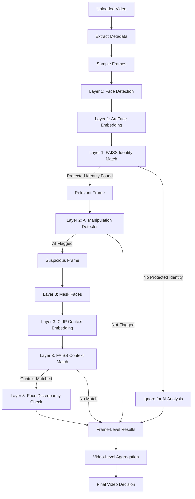

# SWARAKSHA Video Pipeline Architecture

This document describes the layered video analysis pipeline implemented in SWARAKSHA v2.

## Pipeline Architecture

The pipeline processes videos through two main layers to balance accuracy with performance:



## 1. Frame Sampling

Processing every frame in a 30 FPS video is extremely expensive. Instead, the pipeline samples frames at a configurable interval:
- **Interval**: Configured in `config.py` via `VIDEO_SAMPLE_INTERVAL` (default 2.0 seconds).
- **Extraction**: Handled by `core/video_processor.py`. Frames are read dynamically in memory using OpenCV and yielded one by one to avoid large memory footprints or excessive disk writes.

## 2. Layer 1: Identity Matching (Filtering)

For every sampled frame:
1. **Face Detection**: Uses DeepFace/RetinaFace to detect multiple faces.
2. **Embedding**: Generates a 512-d L2-normalized embedding for each detected face.
3. **Matching**: Queries the FAISS index. If cosine similarity passes the threshold (`MATCH_THRESHOLD`), the face is marked as a protected identity.

Only frames containing at least one protected identity are marked as **Relevant Frames** and proceed to the next layer.

## 3. Layer 2: AI Manipulation Analysis

The AI detector is extremely computationally intensive. By filtering out irrelevant frames in Layer 1, the system only invokes the AI detector when a protected individual is present.
- **Input**: The bounding box of the matched face is padded by 20% and cropped.
- **Analysis**: Passed into `AIImageDetector.analyze()`.
- **Result**: Records `is_ai`, `ai_confidence`, and `real_confidence`.

## 4. Aggregation and Final Decision

The backend aggregates results across all sampled frames to reach a robust decision:

### Metrics Calculated:
- **Identity Frame Ratio**: (Frames with protected identity) / (Total sampled frames)
- **Flagged Frame Ratio**: (Frames flagged as AI) / (Frames analyzed by AI)
- **Aggregate Score**: Median score of all AI analyzed frames.

### Decision Logic:
- **NO_THREAT_DETECTED**: No protected identities were found, or protected identities were found but no frames were flagged.
- **POTENTIAL_AI_MANIPULATION**: A high proportion of frames (>= 30%) were flagged, OR at least one frame was flagged AND the median aggregate score exceeds the threshold.
- **REVIEW_REQUIRED**: Some frames were flagged, but not enough to confidently label the entire video automatically.

## API Response Structure

The `/api/scan-video` endpoint returns a rich, structured payload:

```json
{
  "video": {
    "duration": 30.0,
    "fps": 30.0,
    "total_frames": 900,
    "sampled_frames": 15
  },
  "identity": {
    "protected_identity_detected": true,
    "person_ids": ["USR001"],
    "frames_with_identity": 8,
    "identity_frame_ratio": 0.5333
  },
  "ai_analysis": {
    "frames_analyzed": 8,
    "frames_flagged": 6,
    "flagged_frame_ratio": 0.75,
    "aggregate_score": 0.86,
    "status": "POTENTIAL_AI_MANIPULATION"
  },
  "final_status": "POTENTIAL_AI_MANIPULATION",
  "summary": "REVIEW REQUIRED: Potential AI manipulation detected on 6 frames.",
  "frames": [
    // Array of detailed frame-by-frame results with timestamps
  ]
}
```

## Known Limitations

- Real-time processing speed depends heavily on hardware (GPU availability for RetinaFace and Transformers).
- Sampling every 2 seconds may miss deepfake glitches that occur for a very brief moment between intervals.
